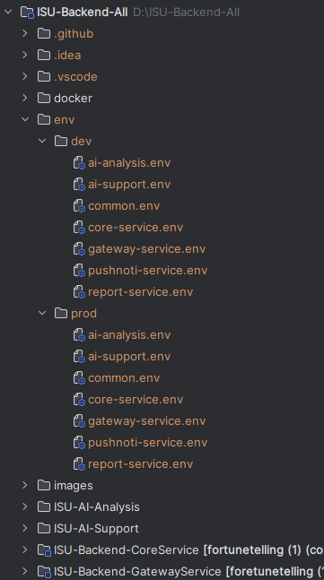
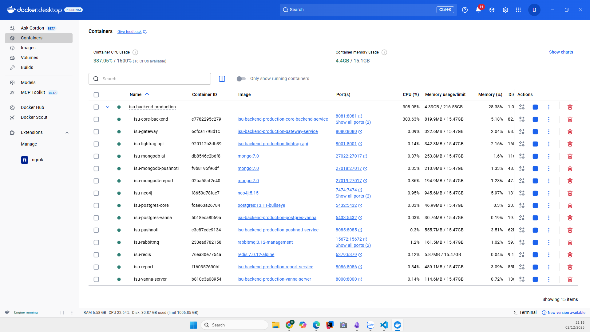

# Installation ISU Backend

## Prerequisites

- Docker & Docker Compose
- Make (If you don't have Make, you can do docker-compose commands manually or install it via https://gnuwin32.sourceforge.net/packages/make.htm)

## 1. Clone repository

```bash
git clone https://github.com/ISeeYou-Fortune-Telling-App/ISU-Backend-Production
cd ISU-Backend-Production
```

## 2. Configure environment

Contact us at `phandinhminh48@gmail.com` to get the env files, then put those in the same level as the project

The example structure should look like this:


## 3. Start the backend

If you want something that easy, friendly to use. Only need to remember those commands:
```shell
# Start the backend container
make quick-start
# Stop and remove containers (keep volume)
make clean
# Stop and remove containers and the volume
make clean-all
```

When all containers start completed, the Docker desktop at containers tab should look like this (which means the backend is running:
