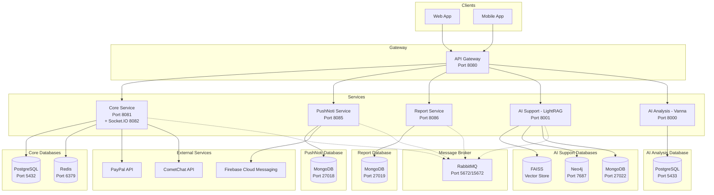

# ISeeYou Fortune Telling Platform - Backend Services

A comprehensive microservices-based backend system for the **ISeeYou Fortune Telling Platform** - a mobile application connecting users with professional fortune tellers (seers) for personalized consultations including Tarot reading, Astrology, Palmistry, and more.

Our mission is to **build a nationwide fortune telling community**, connecting spiritual seekers with verified professional seers across the country. ISeeYou creates a trusted ecosystem where users can easily discover, connect, and consult with fortune tellers regardless of geographical boundaries - bringing ancient wisdom into the digital age.

## About This Project

This backend powers the ISeeYou web and Android app and with a robust, scalable architecture built on:

- **Spring Boot 3.x** - Core microservices framework for Java-based services
- **Spring Cloud Gateway** - API Gateway for routing, load balancing, and security
- **FastAPI (Python)** - AI-powered services for intelligent consulting and data analysis
- **Docker & Docker Compose** - Containerized deployment for consistency across environments
- **Message-Driven Architecture** - RabbitMQ for async communication between services

### Key Features

- **Real-time Chat and Video call** - Socket.IO powered live communication between users and seers
- **AI-Powered Consulting** - LightRAG-based knowledge system for fortune telling assistance
- **Smart Analytics** - Vanna AI for natural language data analysis and reporting
- **Push Notifications** - Firebase Cloud Messaging integration
- **Multi-Database Strategy** - PostgreSQL for relational data, MongoDB for documents, Neo4j for knowledge graphs, Redis for caching and jwt refresh tokens

## Architecture Overview



## Services

| Service | Port | Description |
|---------|------|-------------|
| Gateway Service | 8080 | API Gateway, routing, load balancing |
| Core Service | 8081, 8082 | Main business logic, authentication, chat real time |
| PushNoti Service | 8085 | Push notification management |
| Report Service | 8086 | Reports and analytics |
| AI Support | 8001 | AI-powered consulting (LightRAG) |
| AI Analysis | 8000 | AI data analysis (Vanna) |

## Infrastructure

| Service | Port | Description |
|---------|------|-------------|
| PostgreSQL (Core) | 5432 | Main database for Core Service |
| PostgreSQL (Vanna) | 5433 | Database for AI Analysis |
| Redis | 6379 | Cache and JWT refresh token store |
| MongoDB (PushNoti) | 27018 | Database for Push Notification |
| MongoDB (Report) | 27019 | Database for Report Service |
| MongoDB (AI) | 27022 | Database for AI Support |
| Neo4j | 7474, 7687 | Graph database for LightRAG |
| RabbitMQ | 5672, 15672 | Message broker |

## Prerequisites

- Docker & Docker Compose
- Make (If you don't have Make, you can do docker-compose commands manually or install it via https://gnuwin32.sourceforge.net/packages/make.htm)
- Git

## Installation

### 1. Clone repository

```bash
git clone <repository-url>
cd ISU-Backend-Production
```

**Note:** Of course ISU-Backend-Production is the latest, combined version. The origin Backend was built first with only Monolythic architecture, then we split and built more microservices due to the requirements of scalability and maintainability. If you want, I can add you to see the original microservices repo, they are currently private, separate repos for each service:
- ISU-Backend-CoreService
- ISU-Backend-GatewayService
- ISU-Backend-PushNoti
- ISU-Backend-ReportService
- ISU-AI-Support
- ISU-AI-Analysis
- common (this if for common libs shared between services)

### 2. Configure environment

Review and edit files in the `env/` directory:

```
env/
  ├── core-service.env      # Core Service config
  ├── gateway-service.env   # Gateway config
  ├── pushnoti-service.env  # Push Notification config
  ├── report-service.env    # Report Service config
  ├── ai-support.env        # AI Support (LightRAG) config
  ├── ai-analysis.env       # AI Analysis (Vanna) config
  └── common.env            # Shared variables
```

### 3. Start services

```bash
# Start all services
make quick-start

# Or start step by step
make network-create
make up
```

## Common Commands

### Manage all services

```bash
make up              # Start all services
make down            # Stop all services
make build           # Build all services
make rebuild         # Rebuild and restart all
make logs            # View logs
make status          # Check status
make clean           # Remove containers
make clean-all       # Remove everything including volumes
```

### Manage individual services

```bash
# Gateway
make gateway-up / gateway-down / gateway-logs / gateway-rebuild

# Core Service
make core-up / core-down / core-logs / core-rebuild
make core-run          # Run locally with Maven
make core-test         # Run tests

# Push Notification
make pushnoti-up / pushnoti-down / pushnoti-logs / pushnoti-rebuild

# Report Service
make report-up / report-down / report-logs / report-rebuild
make report-import-data    # Import sample data

# AI Support (LightRAG)
make ai-support-up / ai-support-down / ai-support-logs
make ai-support-health     # Check health

# AI Analysis (Vanna)
make ai-analysis-up / ai-analysis-down / ai-analysis-logs
```

### Infrastructure

```bash
make infra-up        # Start databases, Redis, RabbitMQ
make infra-down      # Stop infrastructure
make dev             # Start infra for local development
```

## Project Structure

```
ISU-Backend-All/
├── docker-compose.yaml          # Main Docker Compose file
├── Makefile                     # Management commands
├── env/                         # Environment files
│   ├── core-service.env
│   ├── gateway-service.env
│   ├── pushnoti-service.env
│   ├── report-service.env
│   ├── ai-support.env
│   ├── ai-analysis.env
│   └── common.env
├── ISU-Backend-CoreService/     # Core Service source
├── ISU-Backend-GatewayService/  # Gateway Service source
├── ISU-Backend-PushNoti/        # Push Notification source
├── ISU-Backend-ReportService/   # Report Service source
├── ISU-AI-Support/              # AI Support (LightRAG) source
├── ISU-AI-Analysis/             # AI Analysis (Vanna) source
└── var/                         # Logs (gitignored)
    └── logs/
```

## API Endpoints

### Gateway (Port 8080)

All requests go through the Gateway and are routed to services:

- `/core/**` -> Core Service
- `/notification/**` -> Push Notification Service
- `/report/**` -> Report Service
- `/ai-support/**` -> AI Support Service
- `/ai-analysis/**` -> AI Analysis Service

Example request for login: POST `http://localhost:8080/core/auth/login` with correct credential.
Note: you can try these accounts
```text
Admin account: admin@iseeyou.com
Seer account: thayboivananh@gmail.com
Customer account: phandinhminh@gmail.com

All the password are: P@sswd123.
The fcm token is optional, pass it if you want to try the real time push notification from the app.
```

### Core Service (Port 8081)
View example endpoints at http://localhost:8080/core/swagger-ui.html or http://localhost:8081/swagger-ui.html

### Push Notification Service (Port 8085)
View example endpoints at http://localhost:8080/notification/swagger-ui.html or http://localhost:8085/swagger-ui.html

### Report Service (Port 8086)
View example endpoints at http://localhost:8080/report/swagger-ui.html or http://localhost:8086/swagger-ui.html

### AI Support Service (Port 8001)
View example endpoints at http://localhost:8080/ai-support/docs or http://127.0.0.1:8001/docs

### AI Analysis Service (Port 8000)
View example endpoints at http://localhost:8080/ai-analysis/docs or http://127.0.0.1:8000/docs

## Troubleshooting

### Cannot see endpoints in Swagger UI
Check carefully each services logs in Docker in case of the services failed to start

### Cannot see the data in Report Service 
Try make report-import-data, sometimes this report service does not import the data correctly

### Full reset

```bash
make clean-all
make quick-start
```

## License

Private - ISeeYou Fortune Telling Platform
